# Clínica Online
Hecha para TP de UTN Labo IV

## Ingreso
### Login
Acceso al sistema con validación de credenciales. Cuenta con botones de acceso rápido para facilitar el ingreso de usuarios de prueba (Pacientes, Especialistas y Administradores).

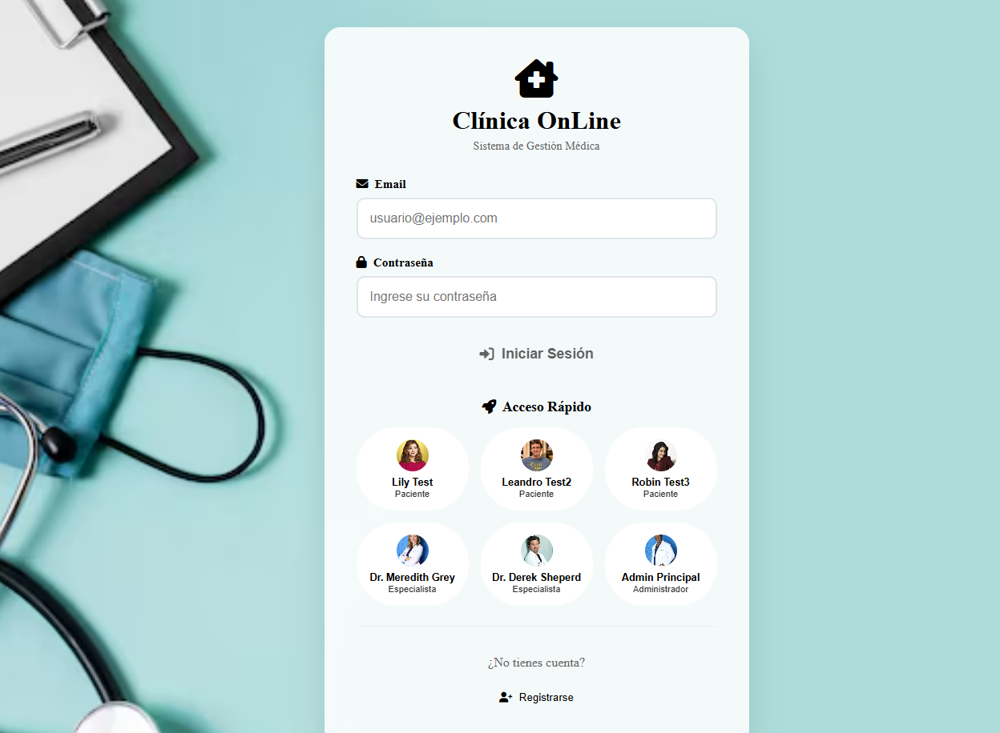

## Registro
Permite el alta de nuevos usuarios en el sistema.
*   **Pacientes:** Requiere datos personales, obra social y dos imágenes de perfil.
*   **Especialistas:** Requiere datos personales, especialidad(es) y una imagen de perfil. Su cuenta debe ser habilitada por un administrador.

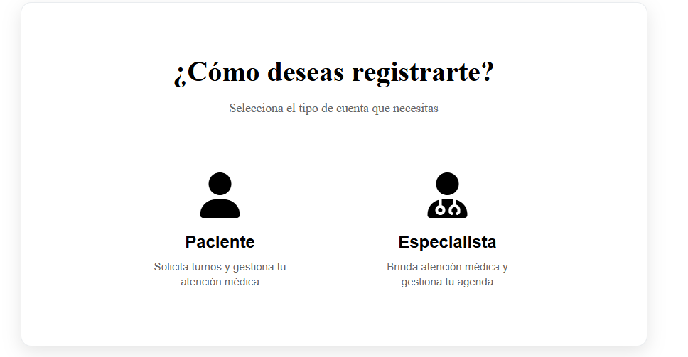

## Home
Pantalla principal que varía según el tipo de usuario, ofreciendo accesos directos a las funcionalidades más relevantes.
*   **Acceso:** Todos los usuarios.

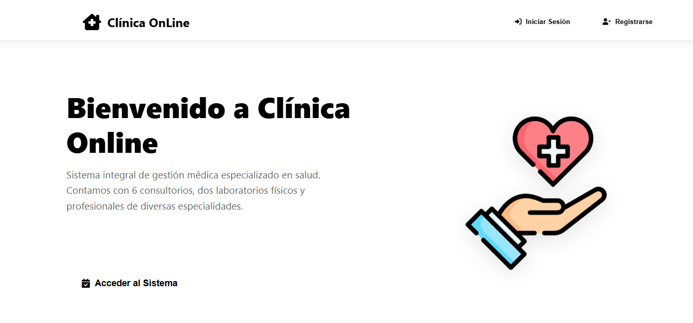

## Mi Perfil
Visualización y edición de datos personales.
*   **Pacientes:** Pueden ver su historia clínica y descargarla en PDF.

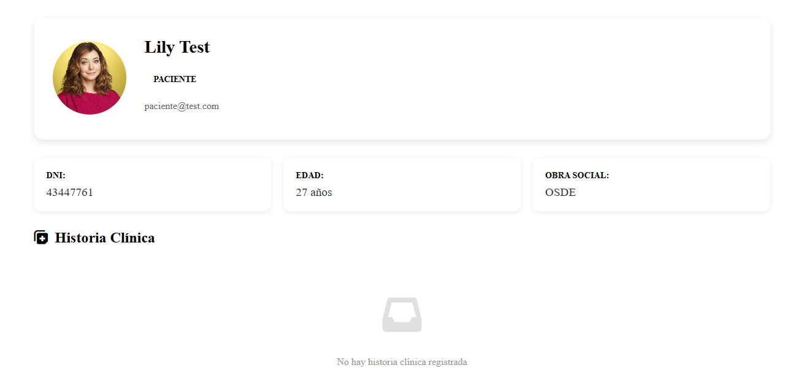

*   **Especialistas:** Pueden configurar sus horarios de disponibilidad ("Mis Horarios").

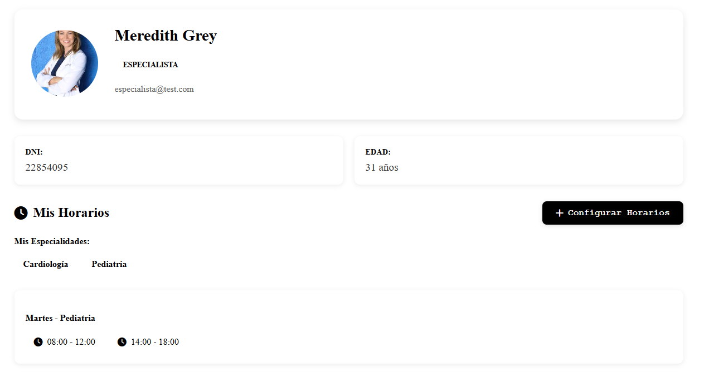

## Mis Turnos
Gestión de citas médicas.
*   **Pacientes:** Ver estado de turnos, cancelar, ver reseñas, completar encuestas y calificar atención. Filtros por especialidad, especialista y datos de historia clínica.

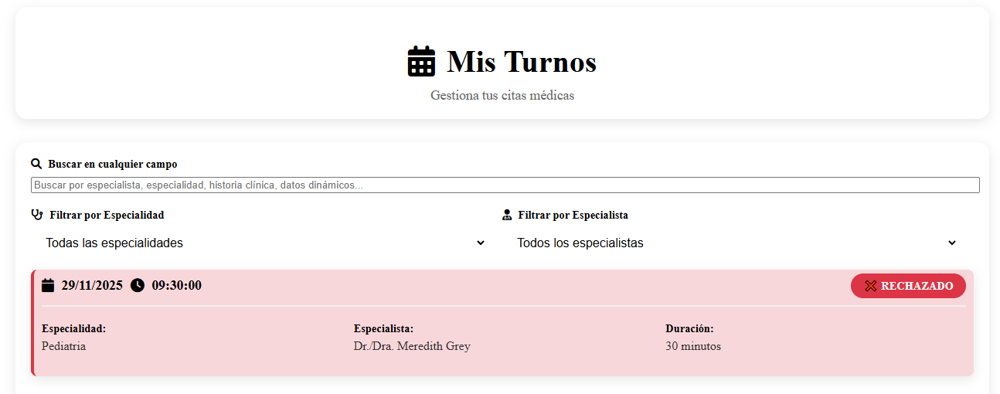

*   **Especialistas:** Ver turnos asignados, aceptar, cancelar, rechazar, finalizar turnos y cargar historia clínica. Filtros por especialidad, paciente y datos de historia clínica.

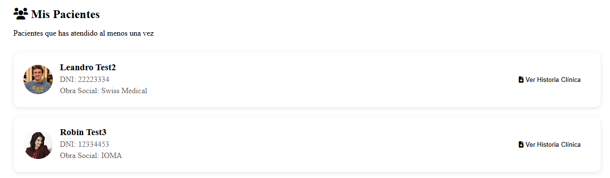

## Solicitar Turno
Proceso paso a paso para agendar una nueva cita. Selección de especialidad, especialista y horario disponible.
*   **Acceso:** Pacientes y Administradores (pueden solicitar turnos para pacientes).

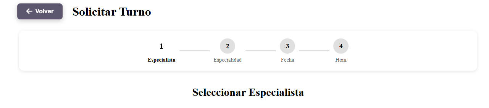

## Gestión de Usuarios
Panel para administrar los usuarios del sistema. Permite habilitar/inhabilitar especialistas, crear nuevos usuarios (incluyendo administradores) y descargar la lista de usuarios en Excel.
*   **Acceso:** Solo Administradores.

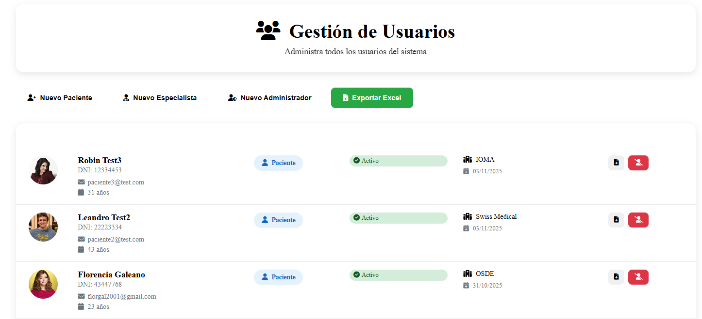

## Gestión de Turnos
Vista global de todos los turnos de la clínica. Permite cancelar turnos si es necesario.
*   **Acceso:** Solo Administradores.

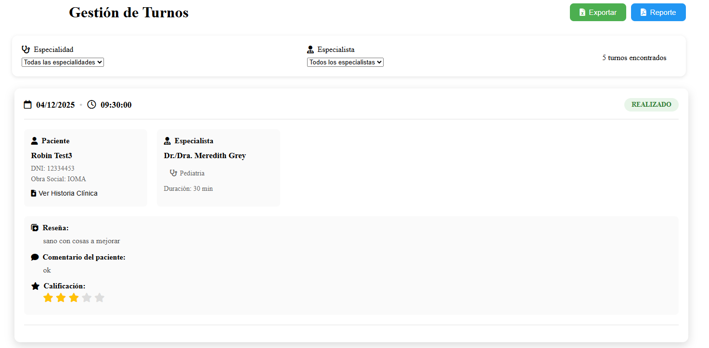

## Estadísticas e Informes
Panel con gráficos y reportes sobre el funcionamiento de la clínica (Log de ingresos, turnos por especialidad, turnos por día, turnos por médico, etc.). Permite descargar informes en Excel.
*   **Acceso:** Solo Administradores.

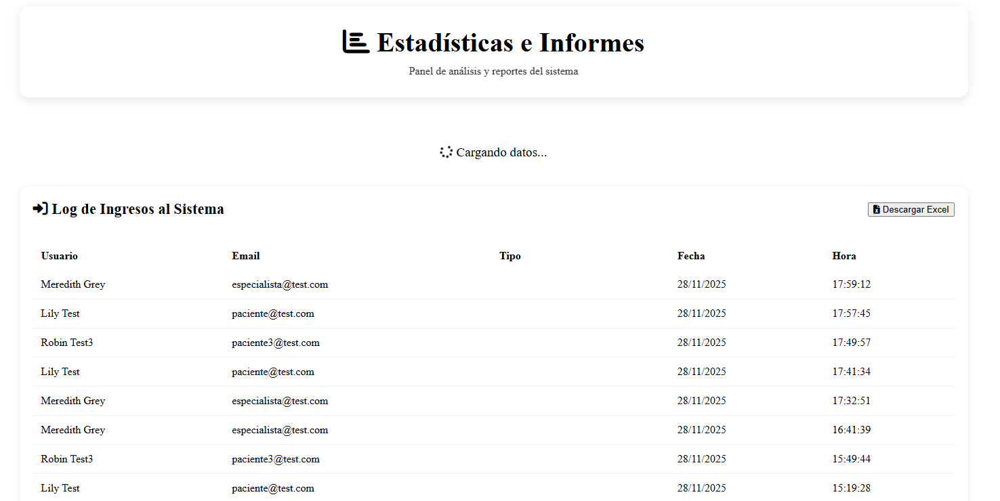
